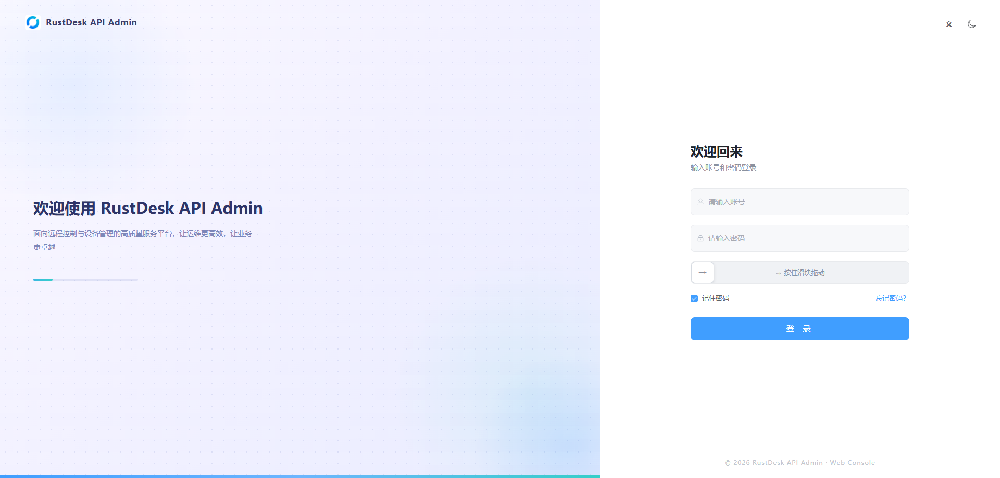
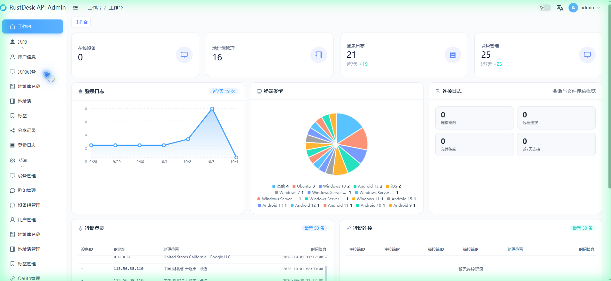
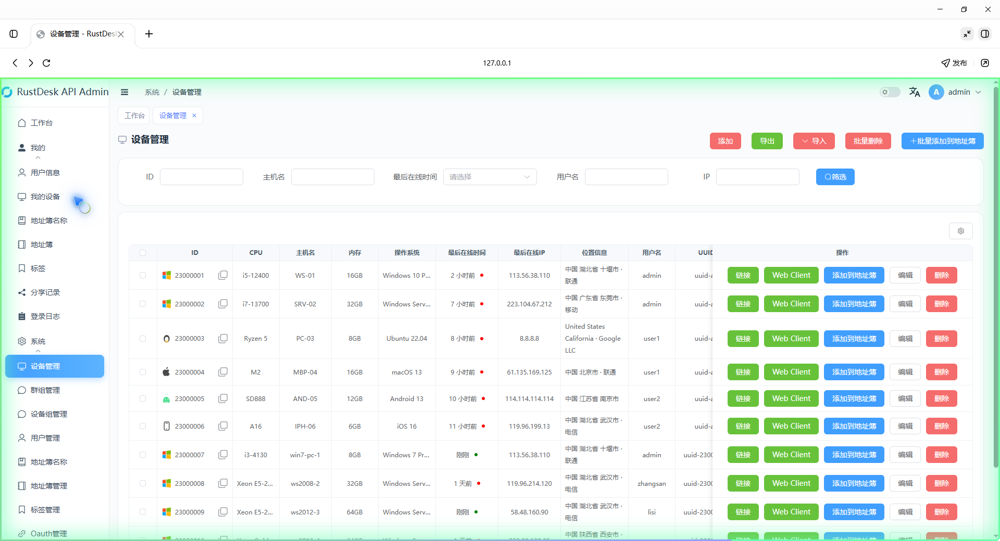
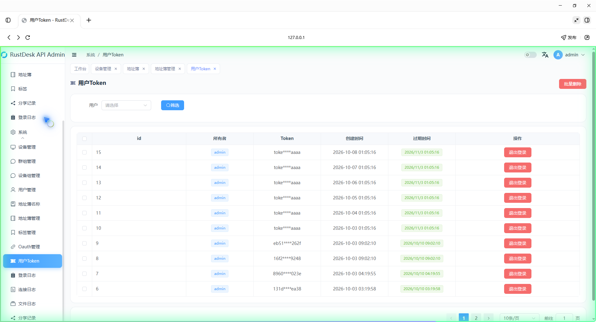

# RustDesk Server 公开版镜像

基于官方 `lejianwen/rustdesk-server-s6` 的定制 RustDesk 服务器镜像，开箱即用，**无内置服务器地址与密钥**，适合自建远程控制服务器。


## 特性

- **定制 hbbs / hbbr**：官方 1.1.16 + lejianwen API 补丁，musl 静态编译，零依赖（详见[hbbs/hbbr 更新说明](#hbbshbbr-更新说明)）
- **定制管理后台**：ART Design Pro 风格前端，内置 **ip2region** 离线 IP 地理位置解析（详见[管理后台说明](#管理后台admin-dist优化与功能说明)）
- **内置完整脱敏配置**：镜像自带 `config.yaml`（Nginx 加速模式 21140）+ `nginx.conf` 模板，开箱即用，无任何服务器 IP/密钥
- **Nginx 加速**：gzip 压缩 + 静态资源 30 天强缓存，webclient2 二次打开秒开
- **网页客户端** `webclient2`：浏览器直接远程控制

## 界面预览

**登录页**（ART Design Pro 风格：滑块验证 + 记住密码 + 多语言/深色模式）



**工作台**（统计卡片 + 登录日志折线图 + 终端类型饼图 + 近期登录/近期连接实时列表）



**设备管理**（系统类型图标 + 位置信息 + 列宽自适应）



**用户 Token**（Token 掩码显示 + 创建/过期时间）



## 快速开始

### 方式一：Docker 直接运行（host 网络，最简单）

镜像已内置完整配置，只需指定你自己的服务器 IP：

```bash
docker run -d --name rustdesk-server --network host --restart unless-stopped \
  -e RELAY=你的公网IP:21117 \
  -e RUSTDESK_API_RUSTDESK_ID_SERVER=你的公网IP:21116 \
  -e RUSTDESK_API_RUSTDESK_RELAY_SERVER=你的公网IP:21117 \
  -e RUSTDESK_API_RUSTDESK_API_SERVER=http://你的公网IP:21114 \
  -e ENCRYPTED_ONLY=1 \
  -e RUSTDESK_API_KEY_FILE=/data/id_ed25519.pub \
  -e RUSTDESK_API_ADMIN_TITLE=RS SERVER \
  -e TZ=Asia/Shanghai \
  -v /root/rustdesk/server:/data \
  -v /root/rustdesk/api:/app/data \
  aippme/rustdesk-server-s6-public:latest
```

> 该方式 apimain 直接监听 21114，无 Nginx 加速。需要加速效果请用方式二。

### 方式二：docker-compose（推荐，含 Nginx 加速）

镜像已**内置脱敏后的完整配置**（`/app/conf/config.yaml` 生产默认 + `/app/resources/nginx.conf` 模板），只需两步：

```bash
mkdir -p /root/rustdesk

# 1) 部署编排（已内置 Nginx 加速服务，改 IP/密钥后使用）
cp docker-compose.example.yml /root/rustdesk/docker-compose.yaml

# 2) 从镜像提取内置 nginx 配置（gzip + 30天静态缓存 + 反代 21140）
docker run -d --name rd-tmp aippme/rustdesk-server-s6-public:latest sleep 5
docker cp rd-tmp:/app/resources/nginx.conf /root/rustdesk/nginx.conf
docker rm -f rd-tmp

# 3) 修改 docker-compose.yaml：把"你的公网IP"替换成真实 IP，
#    RUSTDESK_API_JWT_KEY 替换成随机值（openssl rand -hex 32）

# 4) 启动
docker compose -f /root/rustdesk/docker-compose.yaml up -d
```

> 端口分工：**Nginx 对外监听 21114**（API/管理后台/网页客户端统一入口），apimain 监听内部端口 **21140**，静态资源（webclient2/admin）gzip 压缩 + 30 天强缓存，二次打开秒开。

部署完成后：

- 管理后台：`http://你的IP:21114/_admin/`（默认管理员 `admin` / 密码 `admin123`，**请立即修改**）
- 网页客户端：`http://你的IP:21114/webclient2/`

## 配置说明（详细）

### 一、环境变量

| 变量 | 必填 | 默认值 | 说明 | 示例 |
|---|---|---|---|---|
| `RELAY` | ✅ | - | 中继服务器地址（RustDesk 客户端通过它转发流量），格式 `IP:端口` | `1.2.3.4:21117` |
| `RUSTDESK_API_RUSTDESK_ID_SERVER` | ✅ | - | ID 服务器地址，客户端注册/打洞用 | `1.2.3.4:21116` |
| `RUSTDESK_API_RUSTDESK_RELAY_SERVER` | ✅ | - | 中继地址（API 侧配置，一般与 `RELAY` 相同） | `1.2.3.4:21117` |
| `RUSTDESK_API_RUSTDESK_API_SERVER` | ✅ | - | API 服务地址，管理后台/网页客户端调用 | `http://1.2.3.4:21114` |
| `ENCRYPTED_ONLY` | 否 | `1` | 强制加密：`1` 开启（客户端必须导入公钥）/ `0` 关闭 | `1` |
| `MUST_LOGIN` | 否 | `N` | 是否强制登录：`Y` 强制 / `N` 不强制 | `N` |
| `RUSTDESK_API_KEY_FILE` | 否 | `/data/id_ed25519.pub` | 服务器公钥文件路径（首启自动生成密钥对） | `/data/id_ed25519.pub` |
| `RUSTDESK_API_ADMIN_TITLE` | 否 | `RustDesk API Admin` | 管理后台标题 | `RS SERVER` |
| `RUSTDESK_API_JWT_KEY` | ✅建议 | 空 | API JWT 签名密钥，**务必设置随机值**（64 位 hex） | `openssl rand -hex 32` |
| `RUSTDESK_API_GIN_API_ADDR` | 否 | `0.0.0.0:21140` | API 内部监听地址。Nginx 加速模式保持 `0.0.0.0:21140`；不用 Nginx 时改 `0.0.0.0:21114` | `0.0.0.0:21140` |
| `LIMIT_SPEED` | 否 | 0 | 中继限速（KB/s，0 不限制） | `100` |
| `RUSTDESK_API_APP_BAN_THRESHOLD` | 否 | 0 | 登录失败多少次封禁（0 关闭） | `3` |
| `TZ` | 否 | `Asia/Shanghai` | 容器时区 | `Asia/Shanghai` |

### 二、config.yaml（API 配置）

镜像已内置 `/app/conf/config.yaml`（脱敏默认版），无需手动挂载。内置配置要点：

- `gin.api-addr: "0.0.0.0:21140"` —— Nginx 加速模式（21114 已让给 Nginx 对外服务）
- `app.web-client: 1` —— 启用网页客户端
- `app.register: false` —— 关闭开放注册（更安全）
- `jwt.key: ""` —— 由环境变量 `RUSTDESK_API_JWT_KEY` 注入

需要自定义时（如开放注册、改 Token 有效期、接 MySQL/PostgreSQL）：

```bash
cp config.yaml.example /root/rustdesk/config.yaml   # 仓库内附完整示例
# 编辑后，在 docker-compose.yaml 的 rustdesk 服务中取消挂载注释：
#   - /root/rustdesk/config.yaml:/app/conf/config.yaml:ro
docker compose -f /root/rustdesk/docker-compose.yaml restart rustdesk
```

### 三、Nginx 加速（webclient2 秒开）

| 配置项 | 值 | 作用 |
|---|---|---|
| 监听端口 | `21114` | 对外统一入口（原 apimain 的 21114 让给 Nginx） |
| 上游 | `127.0.0.1:21140` | apimain 内部端口（全量反代，保留所有路由/API） |
| gzip | `on` + `gzip_types *` + `gzip_proxied any` | 静态 JS/CSS 压缩 60%+，且允许压缩反代响应 |
| 静态缓存 | `expires 30d` + `Cache-Control: public, max-age=2592000` | webclient2/web2/admin 资源浏览器强缓存 30 天 |

生效验证：

```bash
# 压缩生效：响应应带 Content-Encoding: gzip
curl -sI -H 'Accept-Encoding: gzip' http://127.0.0.1:21114/webclient2/js/dist/vendor.js

# 缓存生效：响应应带 Cache-Control: public, max-age=2592000
curl -sI http://127.0.0.1:21114/webclient2/js/dist/vendor.js?v=test
```

### 四、数据持久化

| 挂载 | 内容 | 迁移说明 |
|---|---|---|
| `/data` | hbbs 数据 + 服务器密钥 `id_ed25519(.pub)` | 换服务器必须一起迁移（丢了公钥客户端全部掉线） |
| `/app/data` | API 数据库（用户/设备/日志/地址簿） | 迁移后用户/设备/日志全部保留 |

### 五、端口

| 端口 | 协议 | 用途 |
|---|---|---|
| 21114 | TCP | API / 管理后台 `/_admin/` / 网页客户端 `/webclient2/`（Nginx 模式由 Nginx 监听） |
| 21116 | TCP+UDP | ID 服务器（TCP 注册 + UDP 打洞，**P2P 直连关键**） |
| 21117 | TCP | 中继服务器 |

防火墙放行：`21114/tcp 21116/tcp 21116/udp 21117/tcp`。

### 六、客户端连接配置

RustDesk 客户端 → 设置 ID/中继服务器：

```
ID 服务器:  你的IP:21116
中继服务器: 你的IP:21117
API 服务器: http://你的IP:21114（自编译客户端内置；官方客户端在"网络"页填写）
```

加密模式（`ENCRYPTED_ONLY=1`）需先在客户端导入服务器公钥：

```bash
cat /root/rustdesk/server/id_ed25519.pub   # 把内容填入客户端"设置-安全-密钥"
```

---

## hbbs/hbbr 更新说明

| 项 | 值 |
|---|---|
| 内核版本 | 官方 rustdesk-server **1.1.16** |
| 附加补丁 | **lejianwen fork 的 RustDesk API 补丁**（hbbs/hbbr 需配合 API 服务使用管理后台） |
| 编译方式 | musl 静态编译（zig 工具链），零动态依赖，容器内直接运行 |

### 官方 1.1.16 相对旧版本的变化

- 基于官方 1.1.16 发布版本，包含上游在 NAT 穿透（打洞）、中继连接、日志与稳定性方面的历次修复
- 与 lejianwen/rustdesk-server-s6 镜像同源，服务脚本（s6-overlay）与目录结构完全兼容

### 定制补丁（lejianwen API）

在官方 1.1.16 内核上合并了 lejianwen fork 的 API 补丁，约 500 行新增：

| 文件 | 变更 |
|---|---|
| `src/jwt.rs` | 新增：JWT 签发/校验（管理后台登录态） |
| `src/main.rs` / `src/lib.rs` | 接入 API 路由与配置项 |
| `src/rendezvous_server.rs` | 同步打洞/在线状态数据到 API 侧 |
| `Cargo.toml` / `Cargo.lock` | 新增依赖（jwt 等） |

补丁带来的能力：

- **管理后台**：用户 / 设备 / 地址簿 / Token / 登录日志 / 审计日志 / 系统信息
- **API 接口**：`/api/...` 供网页客户端与管理后台调用（21114 端口）
- **在线状态同步**：设备在线/离线状态与 API 侧实时同步

> 纯二进制替换：`hbbs`（ID 服务器）/ `hbbr`（中继服务器）直接覆盖镜像内 `/usr/bin/` 对应文件，不修改官方入口与数据目录结构。

---

## 管理后台（admin-dist）优化与功能说明

管理后台前端基于官方 `rustdesk-api-web`（Vue3 + Element Plus + Vite）深度定制，版本 **v76**。

### UI 优化（ART Design Pro 风格）

- **登录页**：ART 风格界面 + 记住密码 + 滑块验证
- **工作台**：
  - 顶部统计卡片组（在线设备/地址簿/登录日志/设备管理 4 卡，ART 配色）
  - **终端类型饼图**（按设备操作系统白名单分类统计，Windows 7/10/11、Android 9~15、Ubuntu、iOS 等，未命中归"其他"）
  - **登录日志折线图**（渐变背景，按天统计）
  - **近期登录 / 近期连接** 实时卡片（50 条上限，自动滚动 + 滚动条，展示设备 ID/主控被控端 ID/IP/地理位置/时间）
  - 系统信息：加密密钥、ID/中继/API 服务器地址支持小眼睛掩码切换（默认隐藏）
- **全局规范**：背景 `#fafbfc`、卡片边框 `1px rgba(219,223,233,0.6)`、圆角 `16px`、统一字体字号、菜单滑行动效、全局 ICON 补齐

### 功能增加

| 功能 | 说明 |
|---|---|
| **IP 地理位置解析** | 内置 **ip2region.xdb** 离线库（11MB），日志/设备/连接等页面按 IP 自动显示地理位置与运营商，无需外网接口 |
| **登录日志** | 修复筛选按钮；新增按日期范围筛选；IP 列右侧增加地理位置列 |
| **设备管理** | 隐藏"组"栏目；增加"位置信息"（按最后在线 IP 查询）；ID 栏前显示系统类型图标（Windows/Android/Linux/iOS 标准图标）；列宽自适应、内容不截断 |
| **地址簿** | ID 栏左对齐 + 复制按钮右对齐、列宽自适应、图标统一 |
| **近期实时** | 工作台近期登录/连接数据实时刷新（不刷新页面），最多 50 条 |
| **导航** | 工作台"在线设备"取自设备管理最后在线数据；移除顶部多余卡片 |

### 说明

- `ip2region.xdb` 为离线数据库，随镜像内置，**不依赖任何外网 IP 查询服务**
- 管理后台标题可通过 `RUSTDESK_API_ADMIN_TITLE` 自定义

---

## 更新记录（Changelog）

| 版本 | 日期 | 内容 |
|---|---|---|
| `latest`（v1.1.16-custom） | 2026-10-05 | 定制 hbbs/hbbr（1.1.16 + lejianwen API）+ 管理后台 v76（ART 风格 + ip2region）+ **内置脱敏生产配置**（config.yaml 21140 + nginx.conf 模板）+ 详细文档与界面预览 |

## 本地构建

```bash
docker build -t <your-id>/rustdesk-server-s6-public:latest .
docker push <your-id>/rustdesk-server-s6-public:latest
```

## GitHub Actions 自动构建

推送到 Docker Hub 的自动流程见 `.github/workflows/build.yml`（支持手动触发时额外打版本 tag）。

仓库 Settings → Secrets and variables → Actions 配置：

| Secret | 说明 |
|---|---|
| `DOCKERHUB_USERNAME` | Docker Hub 用户名 |
| `DOCKERHUB_TOKEN` | Docker Hub Access Token |
| `ALIYUN_REGISTRY` | 阿里云镜像仓库地址，如 `registry.cn-hangzhou.aliyuncs.com`（可选） |
| `ALIYUN_NAMESPACE` | 阿里云命名空间（可选） |
| `ALIYUN_USERNAME` | 阿里云账号（可选） |
| `ALIYUN_PASSWORD` | 阿里云密码或专用 Token（可选） |

## 常见问题（FAQ）

**Q1：客户端连接不上？**
- 检查防火墙放行 `21114/tcp 21116/tcp 21116/udp 21117/tcp`
- 确认客户端 ID/中继服务器地址填了端口（如 `IP:21116`）
- 确认环境变量 `RUSTDESK_API_RUSTDESK_ID_SERVER` 等四个地址都改成了公网 IP

**Q2：P2P 直连失败，走了中继？**
- 双方 UDP 21116 需可达；公网环境通常可直接打洞，内网对公网取决于 NAT 类型
- 服务器为 NAT 后时需在路由器映射 `21116/tcp+udp` 和 `21117/tcp`
- 注意：`ENCRYPTED_ONLY=1` 时中继也会加密转发，不影响打洞

**Q3：强制加密怎么用？**
- `ENCRYPTED_ONLY=1` 时，客户端需先导入 `/data/id_ed25519.pub` 公钥
- 首次运行容器后 `cat /root/rustdesk/server/id_ed25519.pub` 查看公钥

**Q4：网页客户端（webclient2）打开慢？**
- 推荐使用方式二（Nginx 加速）：gzip 压缩 + 静态资源 30 天强缓存，二次打开秒开
- 仓库已提供 `nginx.conf.example` + `config.yaml.example` + `docker-compose.example.yml`，按"快速开始-方式二"三步部署

**Q5：迁移服务器？**
- 停容器 → 打包两个数据目录（`/data`、`/app/data`）→ 新机器解压 → 改环境变量 IP → 重启
- **务必连同 `/data/id_ed25519` 私钥一起迁移**，否则客户端公钥不匹配全部掉线

**Q6：镜像里没有我的服务器地址吗？**
- 没有。镜像只含占位符（"你的公网IP"），部署时通过环境变量注入你自己的地址，可放心公开分享
- 公钥/密钥均为首次启动自动生成，镜像本身不含任何私密数据

## 目录结构

```
├── Dockerfile              镜像构建文件
├── hbbs / hbbr             定制服务器二进制（1.1.16 + API 补丁，静态编译）
├── admin-dist/             定制管理后台前端（v76 + ip2region）
├── docs/images/            界面预览图（README 引用）
├── docker-compose.example.yml  生产版部署示例（RustDesk + Nginx 加速）
├── config.yaml.example     API 配置示例（Nginx 模式 api-addr=21140）
├── nginx.conf.example      Nginx 反代/gzip/30天缓存配置示例
├── .dockerignore
└── .github/workflows/      GitHub Actions 自动构建
```
